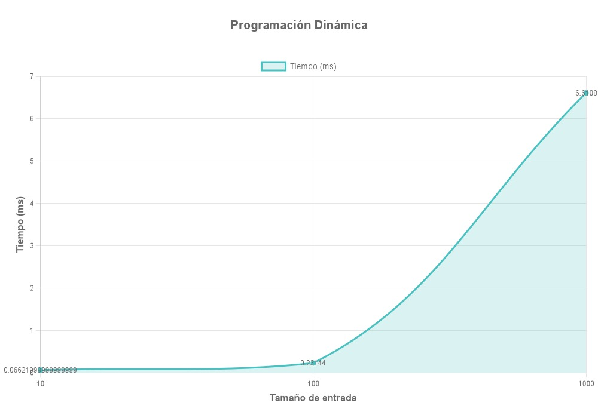
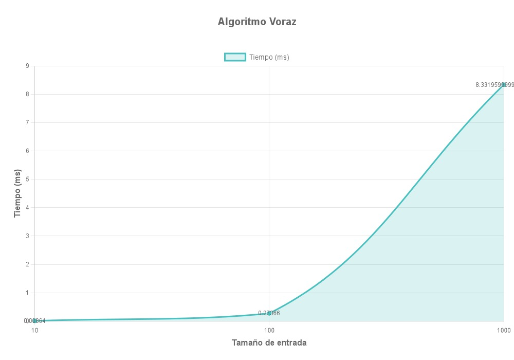
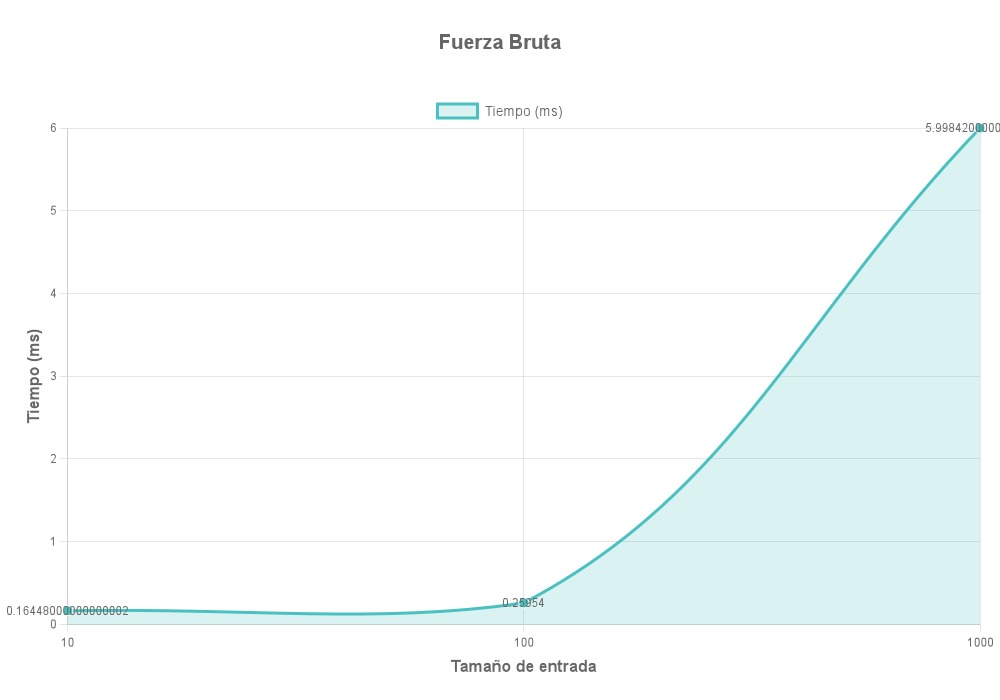

# Análisis Teórico de Complejidad

### Programación Dinámica

- **Complejidad temporal:** `O(n²)`  
  Se rellena una tabla `dp[n][n]`, verificando substrings crecientes en tamaño.

- **Complejidad espacial:** `O(n²)`  
  Usa una matriz cuadrada para guardar resultados de subproblemas.

- **Cota inferior:** `Ω(n²)`  
  Aun en el mejor caso, se necesita al menos recorrer las diagonales de la matriz.

- **Cota superior:** `Θ(n²)`  
  La tabla completa debe construirse para asegurar solución óptima.

  

### Algoritmo Voraz
- **Complejidad temporal:** `O(n²)`  
  Se expanden centros de palíndromos posibles (hasta `2n − 1` centros) con comparaciones por expansión.

- **Complejidad espacial:** `O(n²)`  
  Se almacenan múltiples resultados de expansión (inicio, fin y longitud).

- **Cota inferior:** `Ω(n)`  
  Si el palíndromo está en el centro, solo se necesita una expansión.

- **Cota superior:** `Θ(n²)`  
  Se requiere probar todas las expansiones posibles en el peor caso.

### Fuerza Bruta
- **Complejidad temporal:** `O(n × 2ⁿ)`  
  Genera todas las subsecuencias posibles (`2ⁿ`) y verifica si son palíndromos (hasta `n` caracteres cada una).

- **Complejidad espacial:** `O(2ⁿ)`  
  Se almacenan todas las subsecuencias candidatas en memoria.

- **Cota inferior:** `Ω(n)`  
  Si solo hay un carácter, no se generan combinaciones.

- **Cota superior:** `Θ(n × 2ⁿ)`  
  En el peor caso, se exploran y validan todas las combinaciones posibles.

## Conclusiones

Aunque tanto el algoritmo voraz como el dinámico tienen una complejidad cuadrática teórica, en la práctica el enfoque dinámico es más eficiente debido a menor sobrecarga computacional y acceso directo en estructuras. El algoritmo voraz, pese a ser correcto, puede mostrar tiempos más lentos en casos reales por su enfoque repetitivo de expansión desde el centro. Por otro lado, fuerza bruta garantiza exactitud total, pero su uso está limitado a entradas pequeñas por su explosiva complejidad exponencial. En conjunto, la programación dinámica se posiciona como la opción más equilibrada entre rendimiento y precisión.