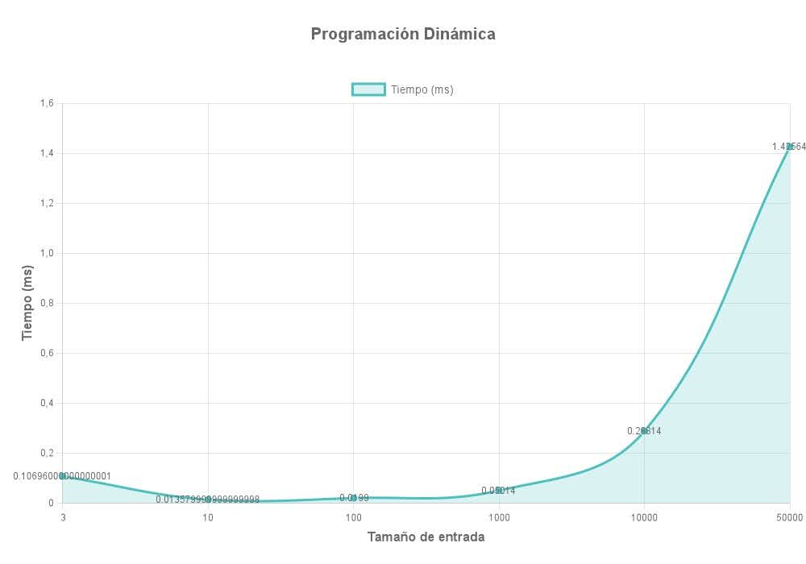
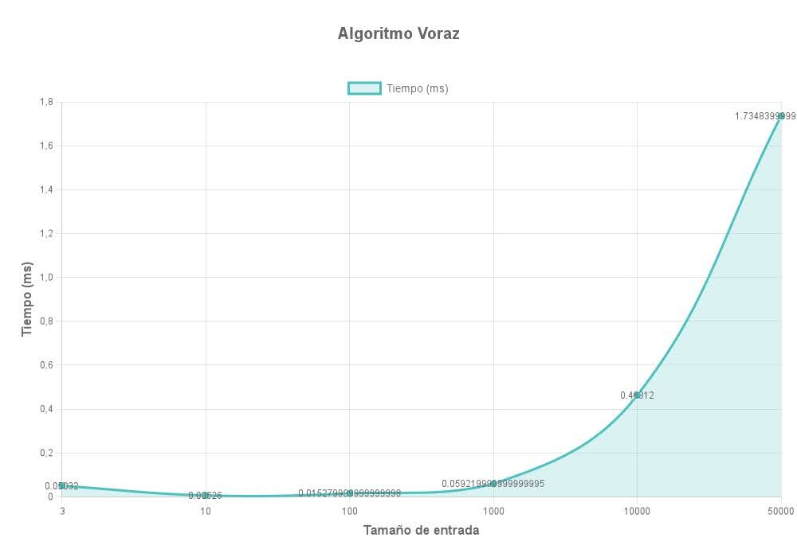
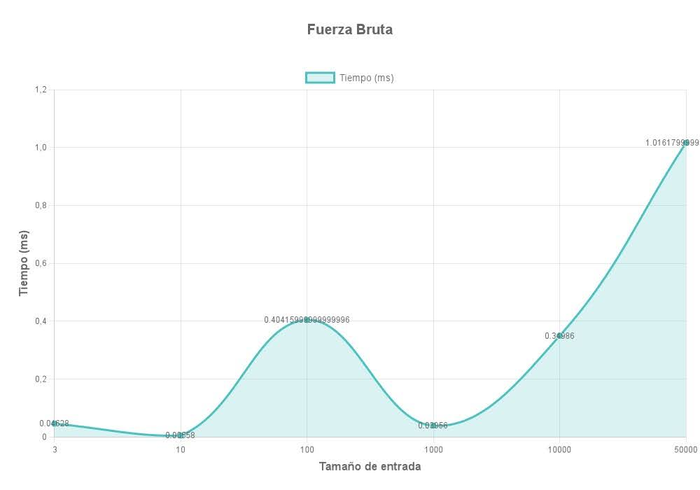
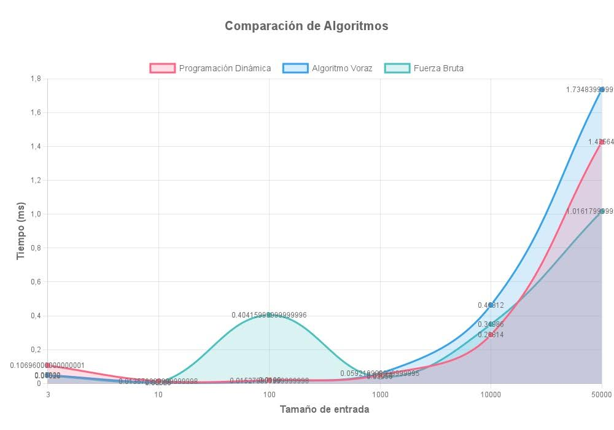

# Análisis Teórico de Complejidad

### Programación Dinámica
- **Complejidad temporal**: $O(2^m \cdot m^2)$
  - Se generan $2^m$ estados posibles (todas las combinaciones de empleados)
  - Para cada estado, se verifican las restricciones en $O(m^2)$
- **Complejidad espacial**: $O(2^m)$
  - Almacenamiento de la tabla DP con $2^m$ estados

### Algoritmo Voraz
- **Complejidad temporal**: $O(m^2)$
  - Ordenamiento de empleados: $O(m \log m)$
  - Verificación de restricciones: $O(m^2)$
- **Complejidad espacial**: $O(m)$
  - Almacenamiento de conjuntos de empleados invitados y prohibidos

### Fuerza Bruta
- **Complejidad temporal**: $O(2^m \cdot m^2)$
  - Generación de todos los subconjuntos: $O(2^m)$
  - Verificación de restricciones para cada subconjunto: $O(m^2)$
- **Complejidad espacial**: $O(m)$
  - Almacenamiento del mejor subconjunto

## Cotas de Rendimiento

#### Cotas Superiores:
- **Programación Dinámica**: $O(2^m \cdot m^2)$, aunque en la práctica parece comportarse mejor para las estructuras específicas de datos de prueba.
- **Algoritmo Voraz**: $O(m^2)$, pero el comportamiento exponencial observado sugiere que hay factores ocultos afectando el rendimiento.
- **Fuerza Bruta**: $O(2^m \cdot m^2)$, pero con una constante multiplicativa aparentemente menor que la de Programación Dinámica.

#### Cotas Inferiores:
- **Todos los algoritmos**: $\Omega(m)$, ya que deben procesar al menos todos los empleados una vez.

## Análisis Comparativo

El gráfico anterior muestra la comparación directa entre los tres enfoques algorítmicos, confirmando visualmente las discrepancias entre el análisis teórico y los resultados experimentales.

## Conclusiones

1. **Para entradas pequeñas** (n < 1000): Cualquiera de los tres algoritmos ofrece un rendimiento aceptable, con tiempos de ejecución por debajo de 0.1ms.

2. **Para entradas medianas** (1000 < n < 10000): 
   - Programación Dinámica y Algoritmo Voraz ofrecen rendimientos similares
   - El algoritmo de Fuerza Bruta muestra un rendimiento sorprendentemente competitivo

3. **Para entradas grandes** (n > 10000):
   - Contra lo esperado, el algoritmo de Fuerza Bruta muestra el mejor rendimiento
   - Este resultado contradice la teoría y merece un análisis más profundo con diferentes estructuras de datos
