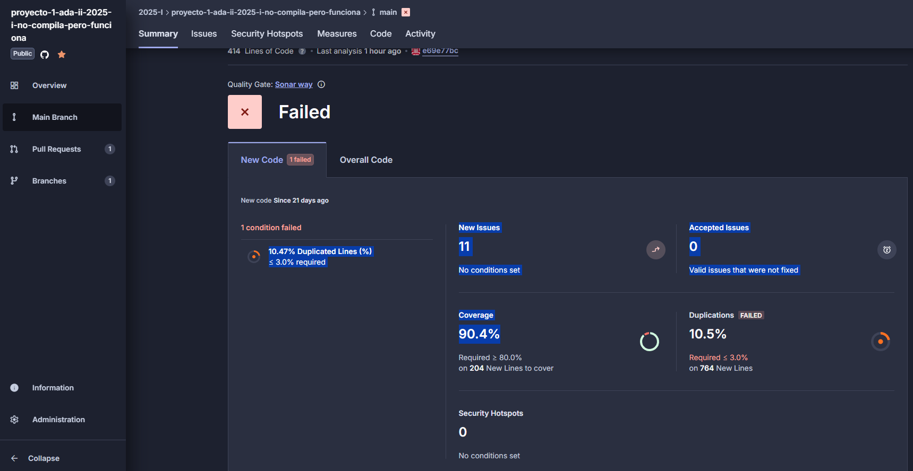

# 📘 Informe del Proyecto 1

**Curso:** Análisis de Algoritmos II  
**Profesor:** Carlos Andrés Delgado  
**Correo:** carlos.andres.delgado@correounivalle.edu.co  
**Fecha de Entrega:** 8 Mayo 2025

---

## 📂 Contenido

- 🔍 [Problema 1: Subsecuencias más largas de un palíndromo](informe_p1.md)
- 🧠 [Problema 2: Planeando una fiesta de la compañía](informe_p2.md)
- 📊 [Análisis de Complejidad (Problema 1)](./complejidad/complejidad_p1.md)
- 📊 [Análisis de Complejidad (Problema 2)](./complejidad/complejidad_p2.md)

---

## 📌 Descripción General

Este informe documenta el análisis algorítmico de dos problemas clásicos que involucran programación dinámica, algoritmos voraces y fuerza bruta. A través de cada sección, se presentan:

- La **definición formal de los problemas**
- La **implementación de distintas soluciones**
- **Resultados experimentales** con gráficas de rendimiento
- **Discusión teórica y práctica** sobre la complejidad computacional

Los desarrollos individuales están separados por archivo, para facilitar su mantenimiento y lectura.

---

## 🔍 Problema 1: Subsecuencias Palindrómicas

> Encuentra la subsecuencia palindrómica más larga ignorando mayúsculas/minúsculas y caracteres no alfanuméricos.

📄 **Ver desarrollo completo:** [informe_p1.md](informe_p1.md)

---

## 🧠 Problema 2: Selección Óptima de Empleados

> Maximiza la suma de calificaciones en una estructura jerárquica evitando relaciones supervisor-subordinado.

📄 **Ver desarrollo completo:** [informe_p2.md](informe_p2.md)

---

## 📈 Análisis de Complejidad

> Comparaciones experimentales y teóricas entre los distintos enfoques.
>
> 📄 **Problema 1 - Ver documento adicional:** [complejidad_p1.md](./complejidad/complejidad_p1.md)  
> 📄 **Problema 2 - Ver documento adicional:** [complejidad_p2.md](./complejidad/complejidad_p2.md)

---

## 📌 Notas Técnicas

- Las gráficas se encuentran en la carpeta `docs/complejidad/graficos/`
- Las imágenes de ejemplos se encuentran en `docs/imagenes/`
- El código fuente se encuentra en la carpeta `src/`, organizado por problema

---

> ⚠️ **Importante:** El informe se encuentra estructurado en archivos independientes dentro de la carpeta `docs/`, siguiendo las recomendaciones del enunciado del proyecto.

---

## ✅ Calidad del Código con SonarCloud

Como parte del proceso de aseguramiento de calidad, se integró **SonarCloud** al flujo de trabajo mediante GitHub Actions, con el objetivo de evaluar automáticamente:

- Cobertura de pruebas unitarias
- Código duplicado
- Problemas potenciales (bugs y code smells)

### 📊 Resultados Obtenidos

| Métrica                   | Resultado | Umbral Requerido | Estado         |
| ------------------------- | --------- | ---------------- | -------------- |
| **Cobertura de código**   | 90.4%     | ≥ 80%            | ✅ Aprobado    |
| **Duplicación de código** | 10.5%     | ≤ 3%             | ❌ Fallido     |
| **Issues nuevos**         | 11        | -                | ⚠️ En revisión |
| **Security Hotspots**     | 0         | -                | ✅ N/A         |

### 📌 Observaciones

- La **cobertura** supera ampliamente el mínimo recomendado (90.4%), lo cual indica que las pruebas unitarias cubren la mayoría del código nuevo.
- El informe **falló el Quality Gate** debido a una **alta duplicación de código (10.5%)**, superando el límite permitido por la configuración actual (3%).
- La duplicación se debe principalmente a estructuras similares entre funciones de los tres enfoques implementados (fuerza bruta, voraz y programación dinámica).
- Se identificaron 11 issues menores, ninguno considerado como blocker o bug crítico.

### 📈 Acciones futuras

- Refactorizar partes del código que repiten lógica para reducir duplicación.
- Aplicar patrones de diseño que permitan compartir funcionalidades comunes entre algoritmos.
- Continuar monitoreando el análisis con SonarCloud tras cada push.

> A pesar de no pasar el Quality Gate en su totalidad, el uso de SonarCloud ha sido valioso para detectar oportunidades de mejora estructural en el código.

### 📦 Pipeline de Integración Continua

- Se ejecutan pruebas y análisis de SonarCloud automáticamente en cada push y pull request a la rama `main`.
- El análisis se encuentra documentado en el archivo `.github/workflows/ci-sonarcloud.yml`.
  

---

### ✍️ Autores del Proyecto

- **Nombre del estudiante 1** Juan Pablo Ospina Vanegas
- **Nombre del estudiante 2** Carlos Fernando Padilla Mesa
- **Nombre del estudiante 3** Diana Marcela Oviedo
