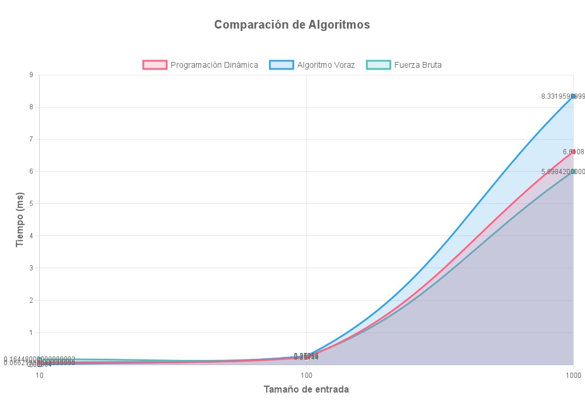

# Análisis Algorítmico: Problema de Selección de Empleados

## 1. Introducción al Problema

El problema abordado en `palindrome.js` consiste en encontrar todas las subsecuencias palindrómicas de máxima longitud en una cadena de caracteres, ignorando diferencias entre mayúsculas/minúsculas y caracteres no alfanuméricos.

Una subsecuencia palindrómica es una secuencia de caracteres que se lee igual hacia adelante que hacia atrás, sin necesidad de que sean caracteres contiguos en la cadena original. Por ejemplo, en la cadena "anitalava", algunas subsecuencias palindrómicas son "ala", "aalaa", "aaa", etc.
Dado esto, se implementaron tres enfoques diferentes para resolver este problema:

1. **Programación Dinámica**: Utilizando matriz para decir si la subcadena es un palindromo.
2. **Algoritmo Voraz**: Buscando centros potenciales de palíndromos y expandiendo hacia afuera
3. **Fuerza Bruta**: Evaluando todos los posibles subsecuencas

## 2. Resultados Experimentales

### Comparación de Tiempos de Ejecución

Los gráficos muestran el tiempo de ejecución (en ms) para diferentes tamaños de entrada:

#### Observaciones Clave:

Se evidecia que de los 3 algoritmos, el más lento o de menor rendimiento 
para las entradas más grandes (1000 elementos), es el voraz con (8.3ms), mientras que;
fuerza bruta muestra un mejor rendimiento que el dinámico con (5.9ms).

---

### Análisis por Algoritmo

#### Programación Dinámica

Se evidencia que el tiempo de ejecución aumenta exponencialmente a medida que crece el tamaño de la entrada.
Hay un leve disparo a partir de los 100 elementos y su tiempo máximo es de 6.6ms para n=1000.

#### Algoritmo Voraz

Se evidencia que, aunque comienza con un tiempo muy bajo para 10 elementos (0.066ms), al llegar a 1000 elementos el tiempo sube a (8.33ms), siendo más lento que el algoritmo dinámico para ese mismo tamaño de entrada.
Por lo tanto, es el que más tarda de los tres algoritmos analizados.

#### Fuerza Bruta

Aquí visualizamos que para entradas pequeñas (10 elementos), ya presenta un tiempo más alto (0.164ms) comparado con los otros dos algoritmos. 
Por lo tanto, presenta un mejor rendimiento temporal que el voraz y similar o ligeramente mejor que el dinámico en los tamaños de entrada probados.

## 4. Implementación del Código

A continuación, se describen los tres enfoques algorítmicos diferentes para resolver el problema de selección óptima de empleados, junto con cada componente del código:

### Funciones Principales
#### `isPalindrome(str)`
- **Función**: Procesar una cadena de caracteres para encontrar su subsecuencia palindrómica más larga utilizando programación dinámica.
- **Proceso**:
    - Normaliza la cadena (elimina tildes, convierte a minúsculas y elimina caracteres no alfanuméricos).

#### `normalizarCadena(str)`
- **Función**: Preparar una cadena para su análisis palindrómico.
- **Proceso**:
    - Convierte a minúsculas
    - Elimina acentos y tildes. 
    - Elimina caracteres no alfanuméricos.

#### `dinamicPalindromeSubsequence(fileContent)`
- **Función**: Aplicar el algoritmo dinámico a múltiples líneas de entrada para encontrar la subsecuencia palindrómica más larga por línea.
- **Proceso**:
    - Separa las líneas del archivo. 
    - Filtra líneas vacías y numéricas (asume que líneas numéricas no son casos válidos). 
    - Normaliza cada línea. 
    - Llama a encontrarSubsecuenciaPalindromica para cada una.

#### `encontrarSubsecuenciaPalindromica(str)`
- **Función**: Encontrar la subcadena palindrómica más larga
- **Proceso**:
    - Usa una matriz 'dp' para verificar si el segmento 'str' es palíndromo 
    - Rellena la matriz -> Subcadenas de 1 y 2 caracteres directamente y subcadenas más largas. 

#### `vorazPalindromeSubsequence(inputString)`
- **Función**: Aplicar un enfoque voraz (expansión desde el centro) para encontrar la subsecuencia palindrómica más larga por línea.
- **Proceso**:
    - Divide y filtra las líneas del input. 
    - Normaliza cada línea. 
    - Llama a encontrarMejorPalindromo.

#### `encontrarMejorPalindromo(str)`
- **Función**: Buscar la subcadena palindrómica más larga por expansión desde el centro.
- **Proceso**:
    - Recorre cada índice como centro. 
    - Expande a la izquierda y derecha verificando que se cumpla el palindromo.

#### `expandirDesdeCentro(str, left, right, resultados)`
- **Función**: Expandir desde el centro hacia los extremos para detectar palíndromos.
- **Proceso**:
    - Mientras los extremos coincidan, guarda la subsecuencia como posible palíndromo. 
    - Continúa expandiendo.

#### `bruteForcePalindromicSubsequence(inputString)`
- **Función**: Encontrar todas las subsecuencias palindrómicas de máxima longitud mediante fuerza bruta.
- **Proceso**:
  - Divide y normaliza cada línea. 
  - Para cadenas cortas, genera todas las posibles subsecuencias con máscaras de bits. 
  - Filtra las subsecuencias que sean palíndromos.
