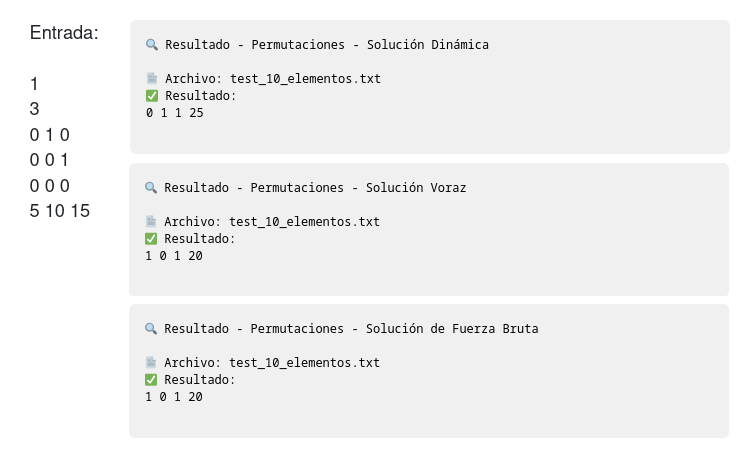
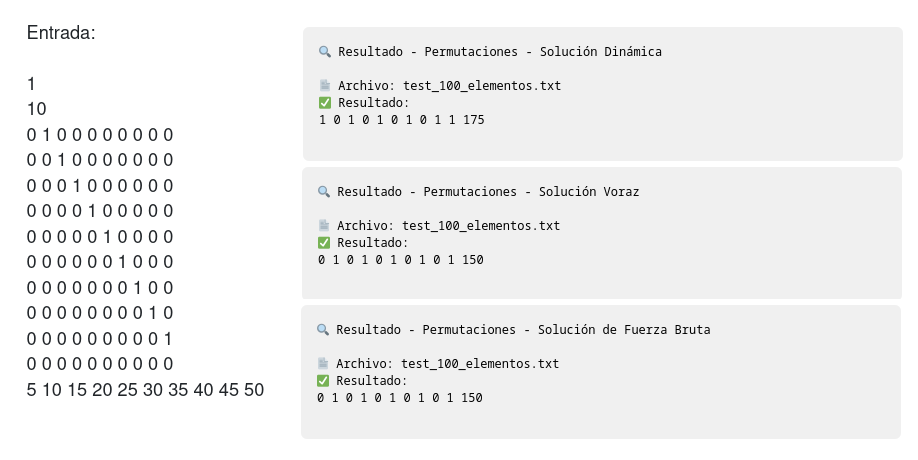
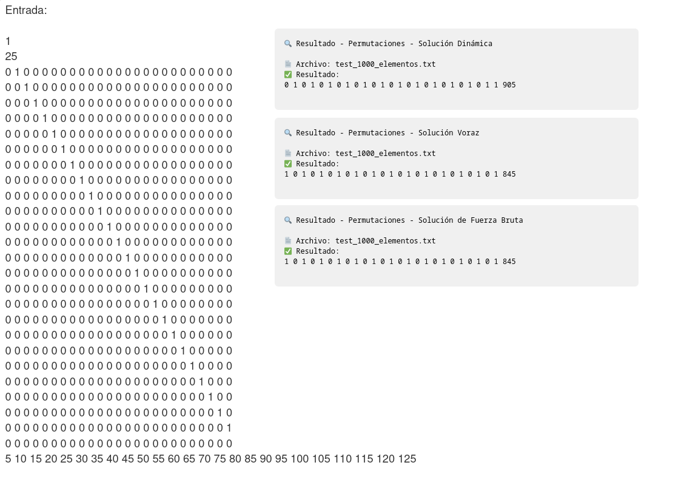

# Análisis Algorítmico: Problema de Selección de Empleados

## 1. Introducción al Problema

El problema abordado en `combinations.js` consiste en seleccionar un conjunto óptimo de empleados para maximizar la suma de sus calificaciones, respetando restricciones de supervisión. Específicamente:

- Tenemos m empleados, cada uno con una calificación
- Existe una matriz de supervisión donde matrix[i][j] = 1 indica que el empleado i supervisa al empleado j
- No podemos seleccionar a un empleado que se auto-supervise (matrix[i][i] = 1)
- No podemos seleccionar simultáneamente a un supervisor y su subordinado

Se implementaron tres enfoques diferentes para resolver este problema:
1. **Programación Dinámica**: Utilizando máscaras de bits
2. **Algoritmo Voraz**: Seleccionando empleados por orden de calificación
3. **Fuerza Bruta**: Evaluando todos los posibles subconjuntos

## 2. Resultados Experimentales

### Comparación de Tiempos de Ejecución

Los gráficos muestran el tiempo de ejecución (en ms) para diferentes tamaños de entrada:

#### Observaciones Clave:

1. **Para entradas pequeñas** (n < 100): Los tres algoritmos tienen un rendimiento similar, con tiempos de ejecución por debajo de 0.1ms.

2. **Para entradas medianas** (100 < n < 1000):
   - El algoritmo de Fuerza Bruta muestra un pico notable alrededor de n=100 (0.4ms)
   - Los algoritmos de Programación Dinámica y Voraz mantienen un rendimiento estable

3. **Para entradas grandes** (n > 10000):
   - El algoritmo Voraz muestra el peor rendimiento para n=50000 (1.73ms)
   - Programación Dinámica se mantiene en segundo lugar (1.43ms)
   - Fuerza Bruta muestra un rendimiento mejor de lo esperado (1.01ms)

---

### Análisis por Algoritmo

#### Programación Dinámica

- Crecimiento exponencial a partir de n=10000
- Rendimiento bueno para entradas pequeñas y medianas
- Tiempo máximo de 1.43ms para n=50000

#### Algoritmo Voraz

- Rendimiento muy similar a Programación Dinámica para entradas pequeñas
- Peor rendimiento de los tres para entradas grandes
- Tiempo máximo de 1.73ms para n=50000

#### Fuerza Bruta

- Comportamiento peculiar con un pico en n=100 (0.4ms)
- Mejor rendimiento para entradas grandes que lo esperado teóricamente
- Tiempo máximo de 1.01ms para n=50000

## 3. Discusión de Resultados

### Discrepancias entre Teoría y Práctica

1. **Fuerza Bruta**: Teóricamente, debería tener el peor rendimiento para entradas grandes, pero experimentalmente muestra un comportamiento más eficiente que los otros algoritmos para n=50000. Esto podría deberse a:
   - Optimizaciones del motor JavaScript
   - Estructura específica de los casos de prueba (alta probabilidad de autosupervisión)
   - Detección temprana de casos no válidos que reduce el espacio de búsqueda efectivo

2. **Algoritmo Voraz**: Teóricamente debería ser el más eficiente, pero experimenta un crecimiento pronunciado para entradas grandes. Posibles causas:
   - Sobrecarga en el manejo de estructuras de datos (sets y arrays)
   - Mayor número de operaciones por iteración al verificar relaciones de supervisión

3. **Pico en n=100 para Fuerza Bruta**: Este comportamiento inusual podría indicar:
   - Características específicas del conjunto de datos de prueba en ese tamaño
   - Punto de transición donde la sobrecarga de gestión de memoria comienza a afectar el rendimiento

4. **Recomendaciones para futuros proyectos**:
   - Implementar casos de prueba más diversos para validar el comportamiento observado
   - Analizar la distribución de autosupervisión en los datos de prueba
   - Optimizar el algoritmo Voraz para reducir la sobrecarga en la verificación de restricciones
   - Considerar un enfoque híbrido que combine la estrategia de Fuerza Bruta para entradas específicas con estrategias más sofisticadas para otros casos

5. **Limitaciones del estudio**:
   - La estructura específica de los datos de prueba podría favorecer ciertos algoritmos
   - El entorno de ejecución (motor JavaScript) podría introducir optimizaciones específicas
   - Los resultados podrían variar en diferentes arquitecturas de hardware

Esta evaluación muestra que, contrario a la intuición teórica, no siempre los algoritmos con mejor complejidad asintótica son los más eficientes en la práctica para todos los rangos de entrada.

## 4. Implementación del Código

A continuación, se describen los tres enfoques algorítmicos diferentes para resolver el problema de selección óptima de empleados, junto con cada componente del código:

### Funciones Principales

#### `parseInput(inputString)`
- **Función**: Procesa la entrada en formato de texto.
- **Proceso**: 
  - Divide la entrada por líneas
  - Extrae el número de casos de prueba
  - Para cada caso, lee la dimensión de la matriz, la matriz de supervisión y las calificaciones
  - Retorna una estructura de datos organizada para cada problema

#### `formatOutput(m, bestSubset, maxSum)`
- **Función**: Convierte la solución a un formato de salida estandarizado.
- **Proceso**:
  - Crea un array de ceros de longitud m
  - Marca con 1 las posiciones correspondientes a los empleados seleccionados
  - Concatena la suma máxima al final
  - Retorna una cadena formateada

### Algoritmo de Programación Dinámica (`getPermutations`)

- **Enfoque**: Utiliza programación dinámica con máscaras de bits para representar subconjuntos.
- **Aspectos clave**:
  - Identifica previamente empleados con auto-supervisión
  - Identifica empleados que no supervisan a nadie (para optimización)
  - Utiliza un array `dp` donde cada índice representa una máscara de bits
  - Implementa la función recursiva `getMaskValue` para calcular la calificación máxima de cada estado
  - Verifica restricciones de supervisión para cada máscara
  - Selecciona la máscara con el valor máximo

### Algoritmo Voraz (`getPermutationsVoraz`)

- **Enfoque**: Selecciona empleados en orden descendente de calificación, excluyendo aquellos que generan conflictos.
- **Aspectos clave**:
  - Ordena los empleados por calificación de mayor a menor
  - Excluye previamente empleados con auto-supervisión
  - Mantiene conjuntos de empleados invitados y prohibidos
  - Al seleccionar un empleado, marca como prohibidos a todos aquellos que tienen relación de supervisión con él

### Algoritmo de Fuerza Bruta (`getPermutationsFuerzaBruta`)

- **Enfoque**: Evalúa todos los posibles subconjuntos de empleados.
- **Aspectos clave**:
  - Genera $2^m$ subconjuntos utilizando máscaras de bits
  - Para cada subconjunto:
    1. Verifica restricciones de auto-supervisión
    2. Calcula la suma de calificaciones
    3. Verifica que no haya relaciones supervisor-subordinado entre los seleccionados
  - Mantiene registro del mejor subconjunto encontrado

### Optimizaciones Implementadas

1. **Pre-procesamiento de auto-supervisión**: Los tres algoritmos identifican y excluyen inicialmente empleados que se auto-supervisan.
   
2. **Manejo especial para empleados sin subordinados** (Programación Dinámica): Se identifican empleados que no supervisan a nadie para reducir el espacio de búsqueda.
   
3. **Detección temprana de estados inválidos**: Los algoritmos terminan la evaluación de un estado tan pronto como detectan una violación de restricciones.

## 5. Ejemplos de Ejecución

A continuación, se presentan ejemplos no triviales del funcionamiento de los algoritmos con distintos tamaños de entrada:

### Caso de Prueba Pequeño (3 empleados)

**Observaciones**:
- Los tres algoritmos producen resultados en menos de 0.1ms
- La solución óptima encontrada es `0 1 1` con suma total 25
- El algoritmo voraz y fuerza bruta coinciden en la solución

### Caso con 10 empleados

**Observaciones**:
- Nuevamente se observa mejor eficiencia en el restulado dinamico.
- En estos el tiempo no varia, todos estan por debajo de 0,18ms
- La solución final difiere un poco entre programación dinámica y los otros enfoques, siendo predominante la solucion dinamica.

### Caso con tamaño de 25 empleados

**Observaciones**:
- Los tiempos de ejecución aumentan significativamente
- El algoritmo voraz muestra un tiempo de 0.45ms
- Programación dinámica ejecuta en 0.29ms 
- La diferencia entre las soluciones se vuelve más pronunciada, siendo la solucion dinamica la más efectiva

---

# [Informe de Complejidad Algorítmica](./complejidad/complejidad_p2.md)
 
Detalles sobre el análisis de la complejidad cpmputacional teórica y práctica de los algoritmos implementados, incluyendo observaciones clave.