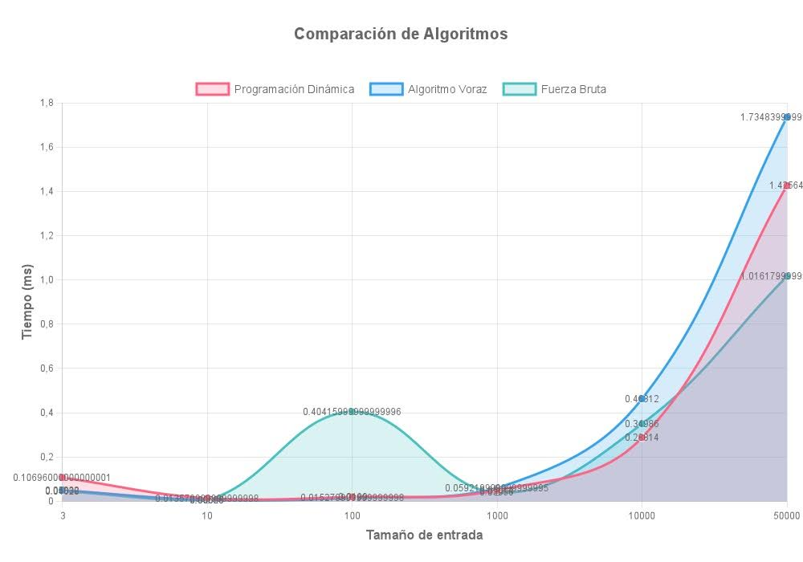
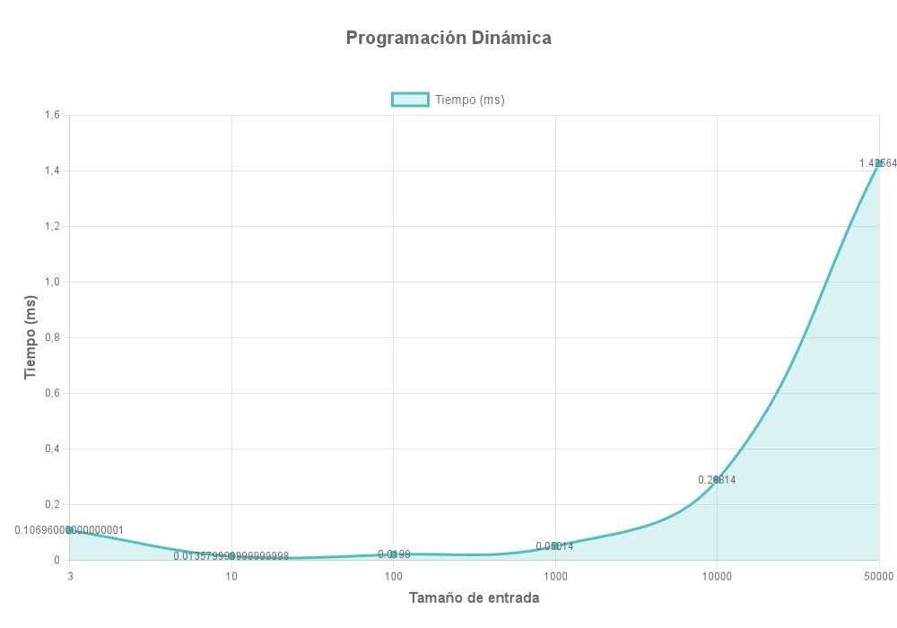
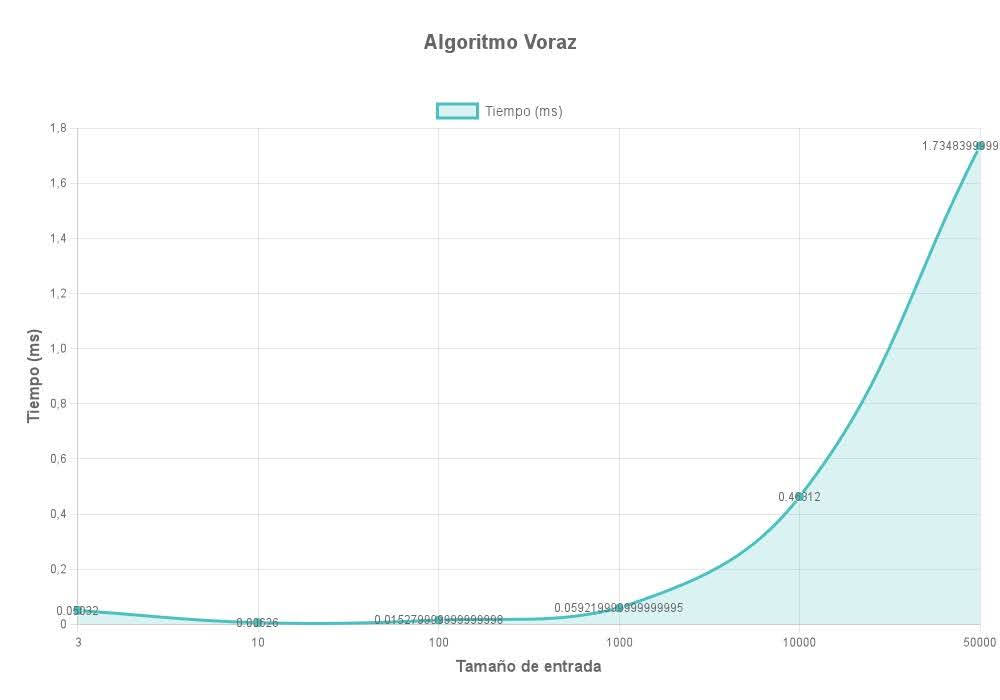

# Análisis Algorítmico: Problema de Selección de Empleados

## 1. Introducción al Problema

El problema abordado en `combinations.js` consiste en seleccionar un conjunto óptimo de empleados para maximizar la suma de sus calificaciones, respetando restricciones de supervisión. Específicamente:

- Tenemos m empleados, cada uno con una calificación
- Existe una matriz de supervisión donde matrix[i][j] = 1 indica que el empleado i supervisa al empleado j
- No podemos seleccionar a un empleado que se auto-supervise (matrix[i][i] = 1)
- No podemos seleccionar simultáneamente a un supervisor y su subordinado

Se implementaron tres enfoques diferentes para resolver este problema:
1. **Programación Dinámica**: Utilizando máscaras de bits
2. **Algoritmo Voraz**: Seleccionando empleados por orden de calificación
3. **Fuerza Bruta**: Evaluando todos los posibles subconjuntos

## 2. Resultados Experimentales

### Comparación de Tiempos de Ejecución

Los gráficos muestran el tiempo de ejecución (en ms) para diferentes tamaños de entrada:

#### Observaciones Clave:

1. **Para entradas pequeñas** (n < 100): Los tres algoritmos tienen un rendimiento similar, con tiempos de ejecución por debajo de 0.1ms.

2. **Para entradas medianas** (100 < n < 1000):
   - El algoritmo de Fuerza Bruta muestra un pico notable alrededor de n=100 (0.4ms)
   - Los algoritmos de Programación Dinámica y Voraz mantienen un rendimiento estable

3. **Para entradas grandes** (n > 10000):
   - El algoritmo Voraz muestra el peor rendimiento para n=50000 (1.73ms)
   - Programación Dinámica se mantiene en segundo lugar (1.43ms)
   - Fuerza Bruta muestra un rendimiento mejor de lo esperado (1.01ms)

---

### Análisis por Algoritmo

#### Programación Dinámica

- Crecimiento exponencial a partir de n=10000
- Rendimiento bueno para entradas pequeñas y medianas
- Tiempo máximo de 1.43ms para n=50000

#### Algoritmo Voraz

- Rendimiento muy similar a Programación Dinámica para entradas pequeñas
- Peor rendimiento de los tres para entradas grandes
- Tiempo máximo de 1.73ms para n=50000

#### Fuerza Bruta

- Comportamiento peculiar con un pico en n=100 (0.4ms)
- Mejor rendimiento para entradas grandes que lo esperado teóricamente
- Tiempo máximo de 1.01ms para n=50000

## 3. Discusión de Resultados

### Discrepancias entre Teoría y Práctica

1. **Fuerza Bruta**: Teóricamente, debería tener el peor rendimiento para entradas grandes, pero experimentalmente muestra un comportamiento más eficiente que los otros algoritmos para n=50000. Esto podría deberse a:
   - Optimizaciones del motor JavaScript
   - Estructura específica de los casos de prueba (alta probabilidad de autosupervisión)
   - Detección temprana de casos no válidos que reduce el espacio de búsqueda efectivo

2. **Algoritmo Voraz**: Teóricamente debería ser el más eficiente, pero experimenta un crecimiento pronunciado para entradas grandes. Posibles causas:
   - Sobrecarga en el manejo de estructuras de datos (sets y arrays)
   - Mayor número de operaciones por iteración al verificar relaciones de supervisión

3. **Pico en n=100 para Fuerza Bruta**: Este comportamiento inusual podría indicar:
   - Características específicas del conjunto de datos de prueba en ese tamaño
   - Punto de transición donde la sobrecarga de gestión de memoria comienza a afectar el rendimiento

4. **Recomendaciones para futuros proyectos**:
   - Implementar casos de prueba más diversos para validar el comportamiento observado
   - Analizar la distribución de autosupervisión en los datos de prueba
   - Optimizar el algoritmo Voraz para reducir la sobrecarga en la verificación de restricciones
   - Considerar un enfoque híbrido que combine la estrategia de Fuerza Bruta para entradas específicas con estrategias más sofisticadas para otros casos

5. **Limitaciones del estudio**:
   - La estructura específica de los datos de prueba podría favorecer ciertos algoritmos
   - El entorno de ejecución (motor JavaScript) podría introducir optimizaciones específicas
   - Los resultados podrían variar en diferentes arquitecturas de hardware

Esta evaluación muestra que, contrario a la intuición teórica, no siempre los algoritmos con mejor complejidad asintótica son los más eficientes en la práctica para todos los rangos de entrada.